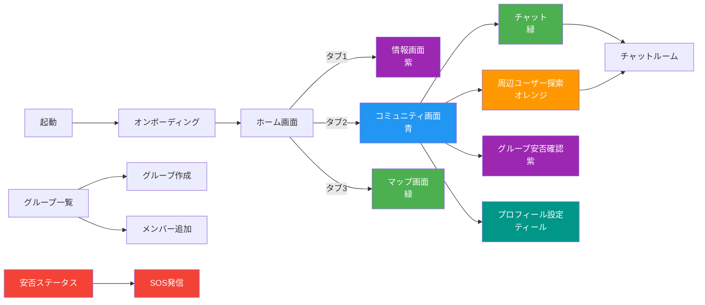
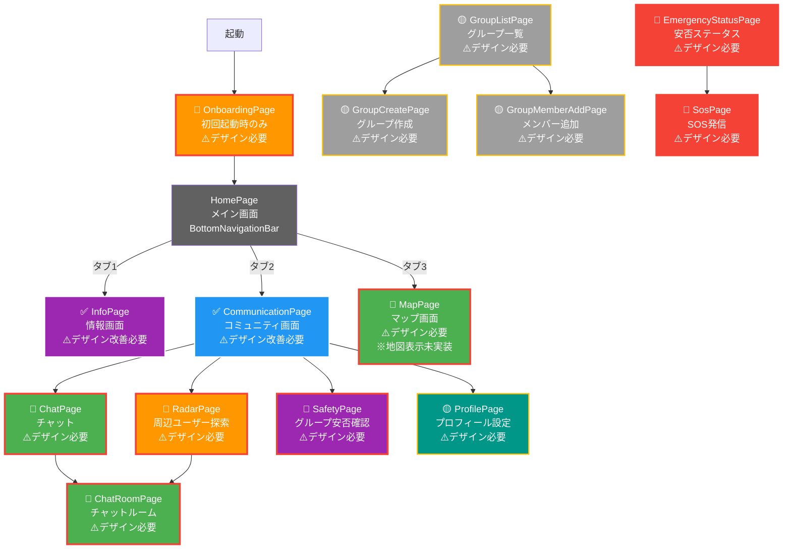

# Resilient Mesh Nav - 画面遷移図

## 概要
このドキュメントは、デザイナー向けの画面遷移図です。各画面の役割、色、遷移関係を記載しています。

---

## 画面遷移図（全体）

### テキスト形式
```
[起動]
  ↓
[OnboardingPage] (初回起動時のみ)
  ↓
[HomePage] ← メイン画面（BottomNavigationBar付き）
  ├─ [InfoPage] (紫のヘッダー) ← タブ1: 情報
  ├─ [CommunicationPage] (青のヘッダー) ← タブ2: コミュニティ
  │   ├─ [RadarPage] (オレンジのヘッダー) - 周辺ユーザー探索
  │   ├─ [ChatPage] (緑のヘッダー) - チャット
  │   │   ├─ [ChatRoomPage] - 1対1チャットルーム
  │   │   ├─ [ChatRoomPage] - グループチャットルーム
  │   │   └─ [ChatBroadcastPage] - 地域掲示板
  │   ├─ [SafetyPage] (紫のヘッダー) - グループ安否確認
  │   └─ [ProfilePage] (ティールのヘッダー) - プロフィール設定
  └─ [MapPage] (緑のヘッダー) ← タブ3: マップ

[その他の画面]
  ├─ [GroupListPage] - グループ一覧
  │   ├─ [GroupCreatePage] - グループ作成
  │   └─ [GroupMemberAddPage] - メンバー追加
  ├─ [EmergencyStatusPage] - 安否ステータス
  └─ [SosPage] - SOS発信
```

### Mermaid形式（詳細な画面遷移図）

```mermaid
graph TD
    Start[起動] --> Onboarding[OnboardingPage<br/>初回起動時のみ<br/>ユーザー登録・権限設定]
    Onboarding --> Home[HomePage<br/>メイン画面<br/>BottomNavigationBar<br/>タブ切り替え]
    
    subgraph HomeTabs["HomePage内のタブ"]
        Home -->|タブ1: 情報| Info[InfoPage<br/>紫のヘッダー<br/>災害情報・避難情報]
        Home -->|タブ2: コミュニティ| Comm[CommunicationPage<br/>青のヘッダー<br/>4つの機能カード]
        Home -->|タブ3: マップ| Map[MapPage<br/>緑のヘッダー<br/>オフラインマップ]
    end
    
    subgraph InfoDetails["InfoPageの要素"]
        Info --> Info1[最終更新日時カード<br/>更新アイコン + 日時表示]
        Info --> Info2[災害状況カード<br/>状況説明 + 避難警告ボックス]
        Info --> Info3[避難情報カード<br/>なぜ避難するか<br/>避難までの時間]
        Info --> Info4[コラムセクション<br/>女性向け情報<br/>応急処置]
    end
    
    subgraph CommDetails["CommunicationPageの要素"]
        Comm --> Comm1[Bluetoothステータス<br/>オフラインモード表示]
        Comm --> Comm2[機能カード1: 周辺ユーザー探索<br/>オレンジアイコン<br/>バッジ: 5人発見]
        Comm --> Comm3[機能カード2: オフライン・チャット<br/>緑アイコン<br/>バッジ: 3件の未読]
        Comm --> Comm4[機能カード3: グループ安否確認<br/>紫アイコン<br/>バッジ: 全員無事]
        Comm --> Comm5[機能カード4: プロフィール設定<br/>ティールアイコン]
    end
    
    Comm2 --> Radar[RadarPage<br/>オレンジのヘッダー<br/>周辺ユーザー探索]
    Comm3 --> Chat[ChatPage<br/>緑のヘッダー<br/>チャットメイン]
    Comm4 --> Safety[SafetyPage<br/>紫のヘッダー<br/>グループ安否確認]
    Comm5 --> Profile[ProfilePage<br/>ティールのヘッダー<br/>プロフィール設定]
    
    subgraph RadarDetails["RadarPageの要素"]
        Radar --> Radar1[フィルタリングバー<br/>言語: 全て/日本語/英語/中国語<br/>信頼グループのみ表示]
        Radar --> Radar2[周辺ユーザーリスト<br/>ステータス: SOS/OK<br/>属性アイコン: 言語/信頼グループ<br/>距離・バッテリー残量<br/>スキル表示]
        Radar --> Radar3[検索/停止ボタン<br/>AppBarアクション]
        Radar --> Radar4[ユーザー詳細<br/>BottomSheet表示<br/>プロフィール・スキル・支援が必要]
        Radar4 --> Radar5[メッセージを送るボタン]
    end
    
    subgraph ChatDetails["ChatPageの要素"]
        Chat --> ChatTab1[タブ1: 1対1<br/>チャットルーム一覧<br/>未読数バッジ]
        Chat --> ChatTab2[タブ2: グループ<br/>グループ作成ボタン<br/>グループルーム一覧]
        Chat --> ChatTab3[タブ3: 掲示板<br/>地域ブロードキャスト]
    end
    
    ChatTab1 --> ChatRoom1[ChatRoomPage<br/>1対1チャットルーム]
    ChatTab2 --> ChatRoom2[ChatRoomPage<br/>グループチャットルーム]
    Radar5 --> ChatRoom1
    
    subgraph ChatRoomDetails["ChatRoomPageの要素"]
        ChatRoom1 --> CR1[定型文ボタン<br/>横スクロール<br/>水を持っていますか?<br/>怪我をしていますか?<br/>大丈夫ですか?<br/>助けが必要です]
        ChatRoom1 --> CR2[メッセージリスト<br/>送信者アイコン<br/>メッセージバブル<br/>時刻表示]
        ChatRoom1 --> CR3[メッセージ入力欄<br/>複数行対応<br/>送信ボタン]
        ChatRoom1 --> CR4[翻訳ボタン<br/>AppBarアクション]
    end
    
    ChatRoom2 --> CR1
    ChatRoom2 --> CR2
    ChatRoom2 --> CR3
    ChatRoom2 --> CR4
    
    subgraph BroadcastDetails["ChatBroadcastPageの要素"]
        ChatTab3 --> BC1[注意書き<br/>デマ防止の警告]
        ChatTab3 --> BC2[ブロードキャストリスト<br/>送信者・時刻<br/>メッセージ内容<br/>翻訳表示]
        ChatTab3 --> BC3[メッセージ送信欄<br/>複数行入力<br/>注意書き表示]
    end
    
    subgraph SafetyDetails["SafetyPageの要素"]
        Safety --> Safe1[ワンタップ報告ボタン<br/>無事です: 緑ボタン<br/>助けが必要: 赤ボタン]
        Safety --> Safe2[グループリスト<br/>ExpansionTile<br/>グループ名・メンバー数]
        Safe2 --> Safe3[ステータスサマリー<br/>無事/SOS/不明の数<br/>円形インジケーター]
        Safe2 --> Safe4[メンバーリスト<br/>アバター・名前<br/>ステータス・最終確認時刻<br/>バッテリー残量]
    end
    
    subgraph ProfileDetails["ProfilePageの要素"]
        Profile --> Prof1[基本情報セクション<br/>名前入力<br/>使用言語選択<br/>国籍選択<br/>宗教的配慮選択]
        Profile --> Prof2[スキル登録セクション<br/>FilterChip複数選択<br/>力仕事・応急処置<br/>医療従事者・翻訳など]
        Profile --> Prof3[支援が必要な事項<br/>FilterChip複数選択<br/>持病・妊娠中<br/>子連れ・高齢者など]
        Profile --> Prof4[プライバシー設定<br/>SwitchListTile<br/>言語/国籍/スキル/支援事項<br/>の公開設定]
        Profile --> Prof5[保存ボタン<br/>AppBarアクション]
    end
    
    subgraph MapDetails["MapPageの要素"]
        Map --> Map1[マップ表示エリア<br/>プレースホルダー<br/>オフライン対応予定]
        Map --> Map2[現在地ボタン<br/>AppBarアクション]
        Map --> Map3[避難経路表示ボタン<br/>緑のElevatedButton]
        Map --> Map4[家族の居場所ボタン<br/>緑のOutlinedButton]
    end
    
    GroupList[GroupListPage<br/>グループ一覧<br/>FAB: グループ作成] --> GroupCreate[GroupCreatePage<br/>グループ作成<br/>グループ名入力<br/>作成ボタン]
    GroupList --> MemberAdd[GroupMemberAddPage<br/>メンバー追加<br/>ユーザーID入力<br/>QRコードスキャン<br/>追加ボタン]
    
    subgraph EmergencyDetails["EmergencyStatusPageの要素"]
        Emergency --> Emerg1[緊急避難通知エリア<br/>警告アイコン<br/>緊急避難情報<br/>避難を促すメッセージ]
        Emergency --> Emerg2[持ち出し品チェックリスト<br/>追加ボタン<br/>CheckboxListTile<br/>飲料水・非常食・常備薬など<br/>削除ボタン付き]
        Emergency --> Emerg3[緊急連絡先リスト<br/>警察: 110<br/>消防・救急: 119<br/>災害用伝言ダイヤル: 171<br/>タップで電話発信]
    end
    
    Emergency --> SOS[SosPage<br/>SOS発信<br/>警告アイコン: 80px<br/>SOSテキスト: 32px太字<br/>赤い発信ボタン<br/>パディング: 横32px縦16px]
    
    style Emerg1 fill:#ffcdd2,color:#000
    style Emerg2 fill:#ffcdd2,color:#000
    style Emerg3 fill:#ffcdd2,color:#000
    
    style Info fill:#9c27b0,color:#fff
    style Comm fill:#2196f3,color:#fff
    style Map fill:#4caf50,color:#fff
    style Radar fill:#ff9800,color:#fff
    style Chat fill:#4caf50,color:#fff
    style Safety fill:#9c27b0,color:#fff
    style Profile fill:#009688,color:#fff
    style Info1 fill:#e1bee7,color:#000
    style Info2 fill:#e1bee7,color:#000
    style Info3 fill:#e1bee7,color:#000
    style Info4 fill:#e1bee7,color:#000
    style Comm1 fill:#bbdefb,color:#000
    style Comm2 fill:#bbdefb,color:#000
    style Comm3 fill:#bbdefb,color:#000
    style Comm4 fill:#bbdefb,color:#000
    style Comm5 fill:#bbdefb,color:#000
    style Radar1 fill:#ffe0b2,color:#000
    style Radar2 fill:#ffe0b2,color:#000
    style Radar3 fill:#ffe0b2,color:#000
    style Radar4 fill:#ffe0b2,color:#000
    style Radar5 fill:#ffe0b2,color:#000
    style ChatTab1 fill:#c8e6c9,color:#000
    style ChatTab2 fill:#c8e6c9,color:#000
    style ChatTab3 fill:#c8e6c9,color:#000
    style CR1 fill:#c8e6c9,color:#000
    style CR2 fill:#c8e6c9,color:#000
    style CR3 fill:#c8e6c9,color:#000
    style CR4 fill:#c8e6c9,color:#000
    style BC1 fill:#c8e6c9,color:#000
    style BC2 fill:#c8e6c9,color:#000
    style BC3 fill:#c8e6c9,color:#000
    style Safe1 fill:#e1bee7,color:#000
    style Safe2 fill:#e1bee7,color:#000
    style Safe3 fill:#e1bee7,color:#000
    style Safe4 fill:#e1bee7,color:#000
    style Prof1 fill:#b2dfdb,color:#000
    style Prof2 fill:#b2dfdb,color:#000
    style Prof3 fill:#b2dfdb,color:#000
    style Prof4 fill:#b2dfdb,color:#000
    style Prof5 fill:#b2dfdb,color:#000
    style Map1 fill:#c8e6c9,color:#000
    style Map2 fill:#c8e6c9,color:#000
    style Map3 fill:#c8e6c9,color:#000
    style Map4 fill:#c8e6c9,color:#000
    style Emergency fill:#f44336,color:#fff
    style SOS fill:#f44336,color:#fff
```


### Mermaid形式（簡易版 - 画面遷移のみ）


### Mermaid形式（デザイン必要ページ表示版 - 簡易）


#### 凡例
- **🔴高優先度**: 緊急時・主要機能で優先的にデザインが必要（太い赤いボーダー）
- **🟡中優先度**: 重要だが高優先度より後回し可能（黄色いボーダー）
- **✅実装済み**: 基本UIが実装済み（白いボーダー）
- **⚠️デザイン必要/改善必要**: デザインの改善・完成が必要

#### デザインが必要なページ一覧

**🔴高優先度（緊急時・主要機能）**
1. **OnboardingPage** - 初回起動時の設定画面
2. **MapPage** - マップ表示（地図表示は未実装、デザイン設計が必要）
3. **RadarPage** - 周辺ユーザー探索画面
4. **ChatPage** - チャットメイン画面
5. **ChatRoomPage** - チャットルーム画面
6. **SafetyPage** - グループ安否確認画面
7. **EmergencyStatusPage** - 安否ステータス画面
8. **SosPage** - SOS発信画面

**🟡中優先度（重要だが後回し可能）**
1. **ProfilePage** - プロフィール設定画面
2. **GroupListPage** - グループ一覧画面
3. **GroupCreatePage** - グループ作成画面
4. **GroupMemberAddPage** - メンバー追加画面

**✅実装済み（デザイン改善必要）**
1. **InfoPage** - 情報画面（基本構造は実装済み、デザイン改善が必要）
2. **CommunicationPage** - コミュニティ画面（基本構造は実装済み、デザイン改善が必要）

---

## 画面詳細

### 1. オンボーディング画面
**パス**: `/onboarding`  
**ファイル**: `OnboardingPage`  
**説明**: 初回起動時のユーザー登録・権限設定  
**色**: デフォルト（Material Design）  
**遷移先**: HomePage（設定完了後）

---

### 2. ホーム画面（メイン画面）
**パス**: `/home`  
**ファイル**: `HomePage`  
**説明**: BottomNavigationBarで3つのタブを切り替えるメイン画面  
**色**: 
- タブ1（情報）: 紫（Purple）
- タブ2（コミュニティ）: 青（Blue）
- タブ3（マップ）: 緑（Green）
- ナビゲーションバー背景: グレー（Grey.shade900）

**遷移**: タブ切り替えで以下3つの画面を表示
- InfoPage
- CommunicationPage
- MapPage

---

### 3. 情報画面
**パス**: `/home`（タブ1）  
**ファイル**: `InfoPage`  
**説明**: 災害情報、避難情報、最終更新日時、コラム表示  
**AppBar色**: 紫（Colors.purple）  
**主な要素**:
- 最終更新日時カード
- 災害状況カード（避難の必要性表示）
- 避難情報カード（なぜ避難するか、何分以内に避難するか）
- コラムセクション（女性向け情報、応急処置）

**遷移**: なし（タブ切り替えのみ）

---

### 4. コミュニティ画面（メイン）
**パス**: `/home`（タブ2）  
**ファイル**: `CommunicationPage`  
**説明**: コミュニティ機能のメイン画面。4つの機能カードを表示  
**AppBar色**: 青（Colors.blue）  
**主な要素**:
- Bluetoothステータス表示（「現在オフラインモード：半径50mの人とつながれます」）
- 4つの機能カード:
  1. 周辺ユーザー探索（オレンジアイコン）
  2. オフライン・チャット（緑アイコン）
  3. グループ安否確認（紫アイコン）
  4. プロフィール・支援設定（ティールアイコン）

**遷移先**:
- `/communication/radar` - 周辺ユーザー探索
- `/communication/chat` - チャット
- `/communication/safety` - グループ安否確認
- `/communication/profile` - プロフィール設定

---

### 5. 周辺ユーザー探索・レーダー画面
**パス**: `/communication/radar`  
**ファイル**: `RadarPage`  
**説明**: Bluetoothで周辺のアプリユーザーを検索・表示  
**AppBar色**: オレンジ（Colors.orange）  
**主な要素**:
- フィルタリングバー（言語、信頼グループのみ表示）
- 周辺ユーザーリスト（属性アイコン、ステータス、距離、バッテリー残量）
- 検索/停止ボタン

**表示情報**:
- ステータス（SOS/OK）の色分け
- 属性アイコン（言語、信頼グループマーク）
- 距離（メートル）
- バッテリー残量
- スキル（最大2つまで表示）

**遷移先**:
- ユーザー詳細（BottomSheet表示）
- `/communication/chat` - メッセージを送るボタンから

---

### 6. チャット画面
**パス**: `/communication/chat`  
**ファイル**: `ChatPage`  
**説明**: チャットのメイン画面。タブで3種類を切り替え  
**AppBar色**: 緑（Colors.green）  
**タブ構成**:
1. **1対1タブ**: 個別チャットルーム一覧
2. **グループタブ**: グループチャットルーム一覧
3. **掲示板タブ**: 地域掲示板（ブロードキャスト）

**遷移先**:
- `/communication/chat/room` - チャットルーム（1対1/グループ）
- 掲示板は同じ画面内で表示

---

### 7. チャットルーム画面
**パス**: `/communication/chat/room`（動的）  
**ファイル**: `ChatRoomPage`  
**説明**: 1対1またはグループチャットの詳細画面  
**AppBar色**: 緑（Colors.green）  
**主な要素**:
- 定型文ボタン（横スクロール）
- メッセージリスト（送信者アイコン、メッセージバブル、時刻）
- メッセージ入力欄
- 翻訳ボタン（AppBar）

**遷移**: なし（戻るボタンでChatPageへ）

---

### 8. 地域掲示板画面
**パス**: `/communication/chat`（タブ3）  
**ファイル**: `ChatBroadcastPage`  
**説明**: 周辺全員へのブロードキャストメッセージ  
**AppBar色**: 緑（Colors.green）  
**主な要素**:
- 注意書き（デマ防止）
- ブロードキャストメッセージリスト（送信者、時刻、翻訳表示）
- メッセージ送信欄

**遷移**: なし（タブ切り替えのみ）

---

### 9. グループ安否確認画面
**パス**: `/communication/safety`  
**ファイル**: `SafetyPage`  
**説明**: 事前に登録した信頼できるメンバーの安否確認  
**AppBar色**: 紫（Colors.purple）  
**主な要素**:
- ワンタップ報告ボタン（無事/SOS）
- グループリスト（展開可能）
  - ステータスサマリー（無事/SOS/不明の数）
  - メンバーリスト（ステータス、最終確認時刻、バッテリー残量）

**遷移**: なし（戻るボタンでCommunicationPageへ）

---

### 10. プロフィール・支援設定画面
**パス**: `/communication/profile`  
**ファイル**: `ProfilePage`  
**説明**: 自分の属性やスキルを登録し、共助をスムーズに  
**AppBar色**: ティール（Colors.teal）  
**主な要素**:
- 基本情報セクション（名前、使用言語、国籍、宗教的配慮）
- スキル登録セクション（複数選択可能）
- 支援が必要な事項セクション（複数選択可能）
- プライバシー設定セクション（各項目の公開設定）

**遷移**: なし（戻るボタンでCommunicationPageへ）

---

### 11. マップ画面
**パス**: `/home`（タブ3）  
**ファイル**: `MapPage`  
**説明**: オフラインでも機能するマップ、避難経路、家族の居場所  
**AppBar色**: 緑（Colors.green）  
**主な要素**:
- マップ表示エリア（現在はプレースホルダー）
- 現在地ボタン（AppBar）
- 避難経路表示ボタン
- 家族の居場所ボタン

**遷移**: なし（タブ切り替えのみ）

---

### 12. グループ一覧画面
**パス**: `/groups`  
**ファイル**: `GroupListPage`  
**説明**: 信頼できるグループの一覧表示  
**AppBar色**: デフォルト  
**主な要素**:
- グループリスト
- グループ作成ボタン（FAB）

**遷移先**:
- `/groups/create` - グループ作成
- `/groups/:groupId/members/add` - メンバー追加

---

### 13. グループ作成画面
**パス**: `/groups/create`  
**ファイル**: `GroupCreatePage`  
**説明**: 新しいグループを作成  
**AppBar色**: デフォルト  
**主な要素**:
- グループ名入力欄
- 作成ボタン

**遷移**: 作成後、GroupListPageへ戻る

---

### 14. メンバー追加画面
**パス**: `/groups/:groupId/members/add`  
**ファイル**: `GroupMemberAddPage`  
**説明**: QRコードやID入力でメンバーを追加  
**AppBar色**: デフォルト  
**主な要素**:
- ユーザーID入力欄
- QRコードスキャンボタン
- 追加ボタン

**遷移**: 追加後、GroupListPageへ戻る

---

### 15. 安否ステータス画面
**パス**: `/emergency`  
**ファイル**: `EmergencyStatusPage`  
**説明**: 安否ステータスの変更  
**AppBar色**: デフォルト  
**主な要素**: （実装内容により異なる）

**遷移先**:
- `/sos` - SOS発信

---

### 16. SOS発信画面
**パス**: `/sos`  
**ファイル**: `SosPage`  
**説明**: SOSを発信  
**AppBar色**: デフォルト  
**主な要素**:
- 大きな警告アイコン
- SOSテキスト
- SOS発信ボタン（赤色）

**遷移**: なし

---

## 色の統一ルール

### AppBarの色
- **情報画面**: 紫（Colors.purple）
- **コミュニティ画面**: 青（Colors.blue）
- **周辺ユーザー探索**: オレンジ（Colors.orange）
- **チャット関連**: 緑（Colors.green）
- **グループ安否確認**: 紫（Colors.purple）
- **プロフィール設定**: ティール（Colors.teal）
- **マップ画面**: 緑（Colors.green）
- **その他**: Material Designのデフォルト

### ステータス表示の色
- **OK（無事）**: 緑（Colors.green）
- **SOS（支援が必要）**: 赤（Colors.red）
- **不明**: グレー（Colors.grey）

---

## デザインのポイント

### 1. ピクトグラムの活用
- 外国人住民にもわかりやすいよう、ISO準拠のピクトグラムを多用
- 言語アイコン、属性アイコンを視覚的に表示

### 2. やさしい日本語対応
- 専門用語を避け、わかりやすい表現を使用
- 翻訳機能の準備（構造のみ実装済み）

### 3. オフライン対応の明示
- Bluetoothステータスを常時表示
- 「現在オフラインモード」などの表示で状態を明確に

### 4. 緊急時の使いやすさ
- ワンタップで操作できる大きなボタン
- 色分けによる直感的な理解（赤=SOS、緑=OK）

### 5. 多言語・多文化対応
- 言語フィルター機能
- 宗教的配慮の設定
- 翻訳表示機能

---

## 画面遷移の優先順位

### 主要な遷移フロー
1. **初回起動**: OnboardingPage → HomePage
2. **日常使用**: HomePage（タブ切り替え）
3. **コミュニティ機能**: CommunicationPage → 各機能画面
4. **グループ管理**: GroupListPage → GroupCreatePage / GroupMemberAddPage
5. **緊急時**: EmergencyStatusPage → SosPage

---

## 実装状況

### 実装済み
- ✅ すべての画面の基本構造
- ✅ ルーティング設定
- ✅ モックデータによるUI表示

### 未実装（TODO）
- ⏳ 実際のBluetooth機能
- ⏳ Firebase連携（チャット履歴）
- ⏳ 自動翻訳機能
- ⏳ 実際の位置情報取得
- ⏳ バッテリー残量の取得
- ⏳ マップの実際の表示

---

## デザイナーへの注意事項

1. **色の一貫性**: 各機能ごとに色が統一されているため、変更時は全体を確認
2. **レスポンシブ対応**: モバイルファーストで設計
3. **アクセシビリティ**: 色だけでなく、アイコンやテキストでも情報を伝える
4. **多言語対応**: テキストは多言語化を想定した長さに調整
5. **緊急時の視認性**: 重要な情報（SOS、避難情報など）は大きく、目立つデザインに

---

最終更新: 2025年12月

